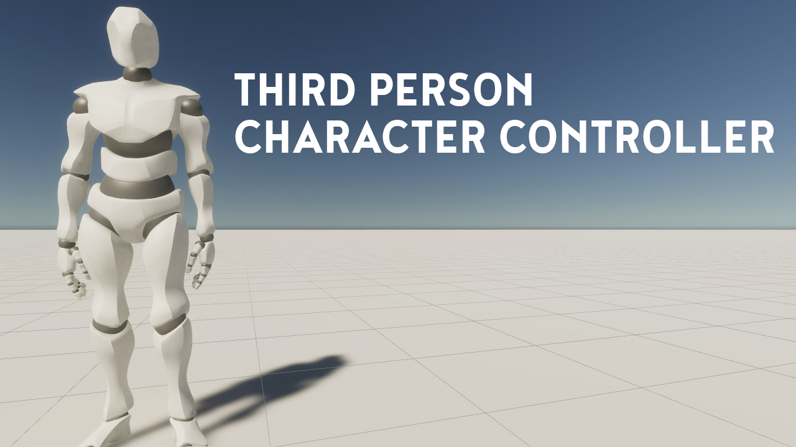
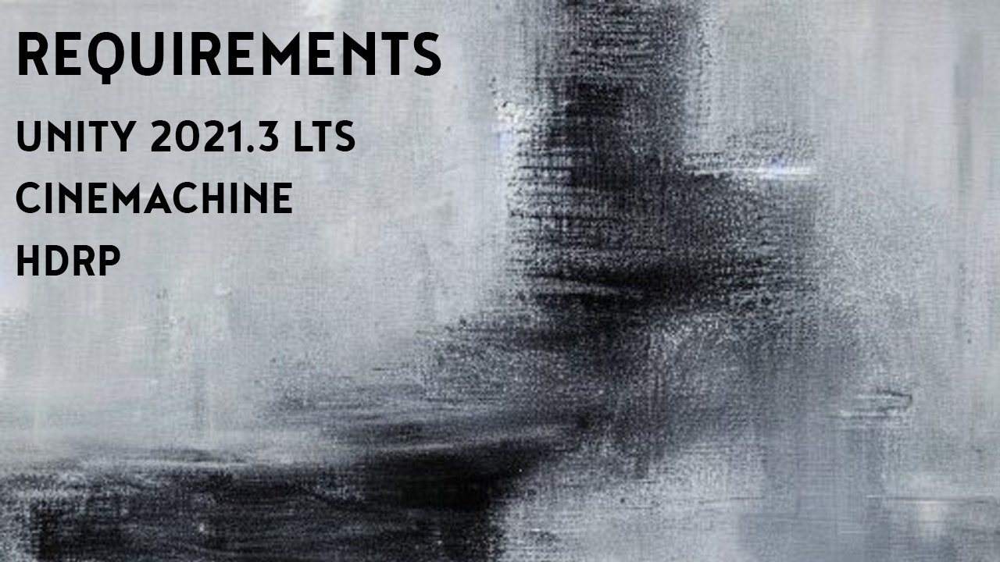

# Third Person Character Controller
Sistem character controller dalam perspektif orang ketiga (Third Person)

# Features
- WASD Movement
- Running
- Walking (Hold Shift)
- Linear Transition between animations
- Lock/Unlock cursor

# Installation Requirements
1. Unity Engine 2021.3 LTS (minimum)
2. Cinemachine 2.8.9 (minimum)
3. HDRP 12.1.6 (minimum)
Jika tidak ingin menggunakan high definition render pipeline, maka bisa download scriptnya langsung (PlayerControl.cs)
